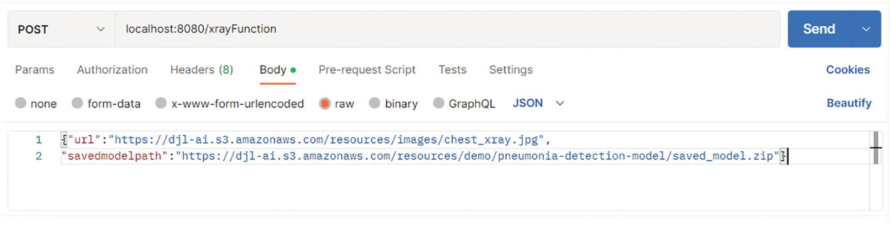
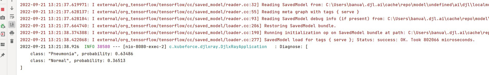
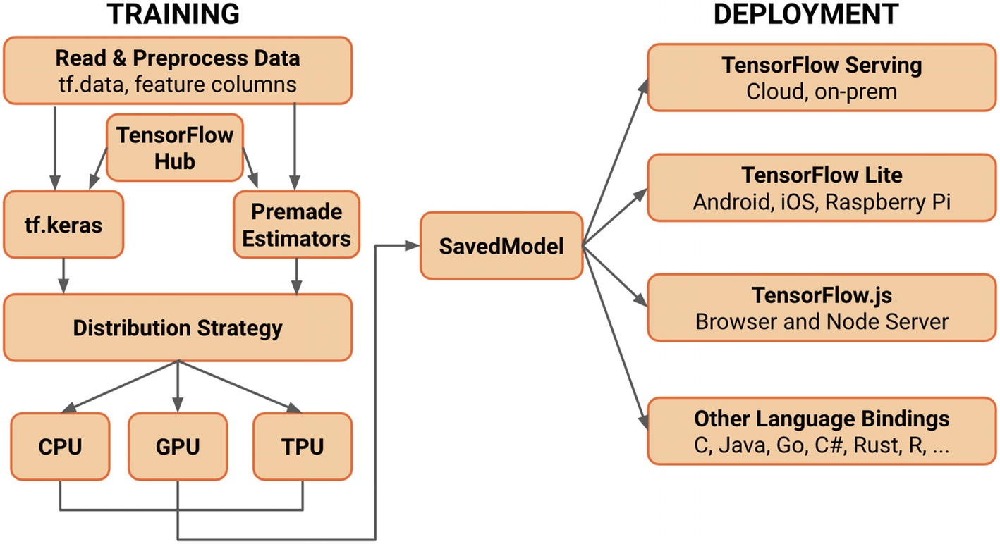

# What Is DJL?
Deep Java Library (DJL) https://docs.djl.ai/ is a high-level, engine-agnostic Java framework for deep learning. It allows you to connect to any framework like TensorFlow or PyTorch and conduct AI/ML activities from Java.

DJL has also great hooks to Spring Boot and can easily be invoked through the Spring Framework. DJL acts as an abstraction layer across frameworks and makes it easy to interact with those frameworks.

There are many components in DJL that are useful to look at, but the DJL serving is interesting.

Run the following commands to get the djl-serving bits. Then unzip the file into your directory of choice and set the path to the serving.bat located at ~\serving-0.19.0\bin\serving.bat. This will allow you to execute serving from anywhere on your machine.

https://github.com/deepjavalibrary/djl-serving

## Installation

For macOS

```
brew install djl-serving

# Start djl-serving as service:
brew services start djl-serving

# Stop djl-serving service
brew services stop djl-serving
```

For Ubuntu

```
curl -O https://publish.djl.ai/djl-serving/djl-serving_0.30.0-1_all.deb
sudo dpkg -i djl-serving_0.30.0-1_all.deb
```

For Windows

We are considering to create a `chocolatey` package for Windows. For the time being, you can
download djl-serving zip file from [here](https://publish.djl.ai/djl-serving/serving-0.30.0.zip).

```
curl -O https://publish.djl.ai/djl-serving/serving-0.30.0.zip
unzip serving-0.30.0.zip
# start djl-serving
serving-0.30.0\bin\serving.bat
```

### Docker

You can also use docker to run DJL Serving:

```
docker run -itd -p 8080:8080 deepjavalibrary/djl-serving
```

# Load a TensorFlow model from TFHub
```bash
serving-0.30.0\bin> serving -m "resnet=https://tfhub.dev/tensorflow/resnet_50/classification/1"

INFO  ModelServer Starting model server ...
INFO  ModelServer Starting djl-serving: 0.30.0 ...
INFO  ModelServer
Model server home: D:\Data\workspaces\STS-4.26.0\serving-0.30.0\bin
Current directory: D:\Data\workspaces\STS-4.26.0\serving-0.30.0\bin
Temp directory: C:\Users\ROBERT~1\AppData\Local\Temp\
Command line:
Number of CPUs: 12
Max heap size: 12264
Config file: N/A
Inference address: http://127.0.0.1:8080
Management address: http://127.0.0.1:8080
Default job_queue_size: 1000
Default batch_size: 1
Default max_batch_delay: 100
Default max_idle_time: 60
Model Store: N/A
Initial Models: resnet=https://tfhub.dev/tensorflow/resnet_50/classification/1
Netty threads: 0
Maximum Request Size: 67108864
Environment variables:
INFO  FolderScanPluginManager scanning for plugins...
INFO  FolderScanPluginManager plug-in folder not exists:D:\Data\workspaces\STS-4.26.0\serving-0.30.0\bin\plugins
INFO  FolderScanPluginManager scanning in plug-in folder :D:\Data\workspaces\STS-4.26.0\serving-0.30.0\plugins
INFO  PropertyFilePluginMetaDataReader Plugin found: plugin-management/jar:file:/D:/Data/workspaces/STS-4.26.0/serving-0.30.0/plugins/plugin-management-plugin-0.30.0.jar!/META-INF/plugin.definition
INFO  PropertyFilePluginMetaDataReader Plugin found: console/jar:file:/D:/Data/workspaces/STS-4.26.0/serving-0.30.0/plugins/management-console-0.30.0.jar!/META-INF/plugin.definition
INFO  PropertyFilePluginMetaDataReader Plugin found: cache-engines/jar:file:/D:/Data/workspaces/STS-4.26.0/serving-0.30.0/plugins/cache-0.30.0.jar!/META-INF/plugin.definition
INFO  PropertyFilePluginMetaDataReader Plugin found: static-file-plugin/jar:file:/D:/Data/workspaces/STS-4.26.0/serving-0.30.0/plugins/static-file-plugin-0.30.0.jar!/META-INF/plugin.definition
INFO  PropertyFilePluginMetaDataReader Plugin found: kserve/jar:file:/D:/Data/workspaces/STS-4.26.0/serving-0.30.0/plugins/kserve-0.30.0.jar!/META-INF/plugin.definition
INFO  PropertyFilePluginMetaDataReader Plugin found: secure-mode/jar:file:/D:/Data/workspaces/STS-4.26.0/serving-0.30.0/plugins/secure-mode-0.30.0.jar!/META-INF/plugin.definition
INFO  FolderScanPluginManager Loading plugin: {console/jar:file:/D:/Data/workspaces/STS-4.26.0/serving-0.30.0/plugins/management-console-0.30.0.jar!/META-INF/plugin.definition}
INFO  PluginMetaData plugin console changed state to INITIALIZED
INFO  FolderScanPluginManager Loading plugin: {plugin-management/jar:file:/D:/Data/workspaces/STS-4.26.0/serving-0.30.0/plugins/plugin-management-plugin-0.30.0.jar!/META-INF/plugin.definition}
INFO  PluginMetaData plugin plugin-management changed state to INITIALIZED
INFO  FolderScanPluginManager Loading plugin: {static-file-plugin/jar:file:/D:/Data/workspaces/STS-4.26.0/serving-0.30.0/plugins/static-file-plugin-0.30.0.jar!/META-INF/plugin.definition}
INFO  PluginMetaData plugin static-file-plugin changed state to INITIALIZED
INFO  FolderScanPluginManager Loading plugin: {cache-engines/jar:file:/D:/Data/workspaces/STS-4.26.0/serving-0.30.0/plugins/cache-0.30.0.jar!/META-INF/plugin.definition}
INFO  PluginMetaData plugin cache-engines changed state to INITIALIZED
INFO  FolderScanPluginManager Loading plugin: {secure-mode/jar:file:/D:/Data/workspaces/STS-4.26.0/serving-0.30.0/plugins/secure-mode-0.30.0.jar!/META-INF/plugin.definition}
INFO  PluginMetaData plugin secure-mode changed state to INITIALIZED
INFO  FolderScanPluginManager Loading plugin: {kserve/jar:file:/D:/Data/workspaces/STS-4.26.0/serving-0.30.0/plugins/kserve-0.30.0.jar!/META-INF/plugin.definition}
INFO  PluginMetaData plugin kserve changed state to INITIALIZED
INFO  PluginMetaData plugin console changed state to ACTIVE reason: plugin ready
INFO  PluginMetaData plugin plugin-management changed state to ACTIVE reason: plugin ready
INFO  PluginMetaData plugin static-file-plugin changed state to ACTIVE reason: plugin ready
INFO  PluginMetaData plugin cache-engines changed state to ACTIVE reason: plugin ready
INFO  PluginMetaData plugin secure-mode changed state to ACTIVE reason: plugin ready
INFO  PluginMetaData plugin kserve changed state to ACTIVE reason: plugin ready
INFO  FolderScanPluginManager 6 plug-ins found and loaded.
INFO  ModelServer Initializing model: resnet=https://tfhub.dev/tensorflow/resnet_50/classification/1
INFO  ModelInfo M-0001: Apply per model settings:
    job_queue_size: 1000
    max_dynamic_batch_size: 1
    max_batch_delay: 100
    max_idle_time: 60
    load_on_devices: *
    engine: TensorFlow
    mpi_mode: null
    option.entryPoint: null
INFO  model_metric DownloadModel.Microseconds:6439604|#Model:resnet
INFO  LibUtils Downloading https://publish.djl.ai/tensorflow/2.16.1/cpu/win-x86_64/native/lib/ucrtbase.dll.gz ...
INFO  LibUtils Downloading https://publish.djl.ai/tensorflow/2.16.1/cpu/win-x86_64/native/lib/api-ms-win-core-libraryloader-l1-1-0.dll.gz ...
INFO  LibUtils Downloading https://publish.djl.ai/tensorflow/2.16.1/cpu/win-x86_64/native/lib/api-ms-win-core-memory-l1-1-0.dll.gz ...
INFO  LibUtils Downloading https://publish.djl.ai/tensorflow/2.16.1/cpu/win-x86_64/native/lib/api-ms-win-crt-multibyte-l1-1-0.dll.gz ...
INFO  LibUtils Downloading https://publish.djl.ai/tensorflow/2.16.1/cpu/win-x86_64/native/lib/api-ms-win-core-errorhandling-l1-1-0.dll.gz ...
INFO  LibUtils Downloading https://publish.djl.ai/tensorflow/2.16.1/cpu/win-x86_64/native/lib/vcruntime140_1.dll.gz ...
INFO  LibUtils Downloading https://publish.djl.ai/tensorflow/2.16.1/cpu/win-x86_64/native/lib/api-ms-win-core-processthreads-l1-1-1.dll.gz ...
INFO  LibUtils Downloading https://publish.djl.ai/tensorflow/2.16.1/cpu/win-x86_64/native/lib/api-ms-win-core-processenvironment-l1-1-0.dll.gz ...
INFO  LibUtils Downloading https://publish.djl.ai/tensorflow/2.16.1/cpu/win-x86_64/native/lib/concrt140.dll.gz ...
INFO  LibUtils Downloading https://publish.djl.ai/tensorflow/2.16.1/cpu/win-x86_64/native/lib/jnitensorflow.dll.gz ...
INFO  LibUtils Downloading https://publish.djl.ai/tensorflow/2.16.1/cpu/win-x86_64/native/lib/api-ms-win-core-localization-l1-2-0.dll.gz ...
INFO  LibUtils Downloading https://publish.djl.ai/tensorflow/2.16.1/cpu/win-x86_64/native/lib/api-ms-win-core-heap-l1-1-0.dll.gz ...
INFO  LibUtils Downloading https://publish.djl.ai/tensorflow/2.16.1/cpu/win-x86_64/native/lib/api-ms-win-crt-locale-l1-1-0.dll.gz ...
INFO  LibUtils Downloading https://publish.djl.ai/tensorflow/2.16.1/cpu/win-x86_64/native/lib/api-ms-win-crt-utility-l1-1-0.dll.gz ...
INFO  LibUtils Downloading https://publish.djl.ai/tensorflow/2.16.1/cpu/win-x86_64/native/lib/api-ms-win-crt-heap-l1-1-0.dll.gz ...
INFO  LibUtils Downloading https://publish.djl.ai/tensorflow/2.16.1/cpu/win-x86_64/native/lib/api-ms-win-crt-runtime-l1-1-0.dll.gz ...
INFO  LibUtils Downloading https://publish.djl.ai/tensorflow/2.16.1/cpu/win-x86_64/native/lib/api-ms-win-core-handle-l1-1-0.dll.gz ...
INFO  LibUtils Downloading https://publish.djl.ai/tensorflow/2.16.1/cpu/win-x86_64/native/lib/api-ms-win-crt-stdio-l1-1-0.dll.gz ...
INFO  LibUtils Downloading https://publish.djl.ai/tensorflow/2.16.1/cpu/win-x86_64/native/lib/api-ms-win-core-util-l1-1-0.dll.gz ...
INFO  LibUtils Downloading https://publish.djl.ai/tensorflow/2.16.1/cpu/win-x86_64/native/lib/api-ms-win-core-interlocked-l1-1-0.dll.gz ...
INFO  LibUtils Downloading https://publish.djl.ai/tensorflow/2.16.1/cpu/win-x86_64/native/lib/vcruntime140.dll.gz ...
INFO  LibUtils Downloading https://publish.djl.ai/tensorflow/2.16.1/cpu/win-x86_64/native/lib/msvcp140.dll.gz ...
INFO  LibUtils Downloading https://publish.djl.ai/tensorflow/2.16.1/cpu/win-x86_64/native/lib/api-ms-win-crt-convert-l1-1-0.dll.gz ...
INFO  LibUtils Downloading https://publish.djl.ai/tensorflow/2.16.1/cpu/win-x86_64/native/lib/api-ms-win-crt-math-l1-1-0.dll.gz ...
INFO  LibUtils Downloading https://publish.djl.ai/tensorflow/2.16.1/cpu/win-x86_64/native/lib/api-ms-win-core-rtlsupport-l1-1-0.dll.gz ...
INFO  LibUtils Downloading https://publish.djl.ai/tensorflow/2.16.1/cpu/win-x86_64/native/lib/api-ms-win-core-console-l1-1-0.dll.gz ...
INFO  LibUtils Downloading https://publish.djl.ai/tensorflow/2.16.1/cpu/win-x86_64/native/lib/LICENSE.gz ...
INFO  LibUtils Downloading https://publish.djl.ai/tensorflow/2.16.1/cpu/win-x86_64/native/lib/api-ms-win-core-file-l2-1-0.dll.gz ...
INFO  LibUtils Downloading https://publish.djl.ai/tensorflow/2.16.1/cpu/win-x86_64/native/lib/api-ms-win-crt-time-l1-1-0.dll.gz ...
INFO  LibUtils Downloading https://publish.djl.ai/tensorflow/2.16.1/cpu/win-x86_64/native/lib/api-ms-win-core-synch-l1-2-0.dll.gz ...
INFO  LibUtils Downloading https://publish.djl.ai/tensorflow/2.16.1/cpu/win-x86_64/native/lib/api-ms-win-core-synch-l1-1-0.dll.gz ...
INFO  LibUtils Downloading https://publish.djl.ai/tensorflow/2.16.1/cpu/win-x86_64/native/lib/tensorflow.dll.gz ...
INFO  LibUtils Downloading https://publish.djl.ai/tensorflow/2.16.1/cpu/win-x86_64/native/lib/api-ms-win-core-sysinfo-l1-1-0.dll.gz ...
INFO  LibUtils Downloading https://publish.djl.ai/tensorflow/2.16.1/cpu/win-x86_64/native/lib/api-ms-win-core-file-l1-1-0.dll.gz ...
INFO  LibUtils Downloading https://publish.djl.ai/tensorflow/2.16.1/cpu/win-x86_64/native/lib/api-ms-win-core-processthreads-l1-1-0.dll.gz ...
INFO  LibUtils Downloading https://publish.djl.ai/tensorflow/2.16.1/cpu/win-x86_64/native/lib/api-ms-win-crt-filesystem-l1-1-0.dll.gz ...
INFO  LibUtils Downloading https://publish.djl.ai/tensorflow/2.16.1/cpu/win-x86_64/native/lib/api-ms-win-core-debug-l1-1-0.dll.gz ...
INFO  LibUtils Downloading https://publish.djl.ai/tensorflow/2.16.1/cpu/win-x86_64/native/lib/vcomp140.dll.gz ...
INFO  LibUtils Downloading https://publish.djl.ai/tensorflow/2.16.1/cpu/win-x86_64/native/lib/api-ms-win-core-string-l1-1-0.dll.gz ...
INFO  LibUtils Downloading https://publish.djl.ai/tensorflow/2.16.1/cpu/win-x86_64/native/lib/api-ms-win-crt-string-l1-1-0.dll.gz ...
INFO  LibUtils Downloading https://publish.djl.ai/tensorflow/2.16.1/cpu/win-x86_64/native/lib/api-ms-win-core-datetime-l1-1-0.dll.gz ...
INFO  LibUtils Downloading https://publish.djl.ai/tensorflow/2.16.1/cpu/win-x86_64/native/lib/api-ms-win-core-namedpipe-l1-1-0.dll.gz ...
INFO  LibUtils Downloading https://publish.djl.ai/tensorflow/2.16.1/cpu/win-x86_64/native/lib/api-ms-win-core-timezone-l1-1-0.dll.gz ...
INFO  LibUtils Downloading https://publish.djl.ai/tensorflow/2.16.1/cpu/win-x86_64/native/lib/libiomp5md.dll.gz ...
INFO  LibUtils Downloading https://publish.djl.ai/tensorflow/2.16.1/cpu/win-x86_64/native/lib/api-ms-win-crt-environment-l1-1-0.dll.gz ...
INFO  LibUtils Downloading https://publish.djl.ai/tensorflow/2.16.1/cpu/win-x86_64/native/lib/api-ms-win-core-profile-l1-1-0.dll.gz ...
INFO  LibUtils Downloading https://publish.djl.ai/tensorflow/2.16.1/cpu/win-x86_64/native/lib/api-ms-win-core-file-l1-2-0.dll.gz ...
2024-12-16 18:52:14.049059: I tensorflow/core/util/port.cc:113] oneDNN custom operations are on. You may see slightly different numerical results due to floating-point round-off errors from different computation orders. To turn them off, set the environment variable `TF_ENABLE_ONEDNN_OPTS=0`.
2024-12-16 18:52:14.069262: I tensorflow/core/platform/cpu_feature_guard.cc:210] This TensorFlow binary is optimized to use available CPU instructions in performance-critical operations.
To enable the following instructions: SSE SSE2 SSE3 SSE4.1 SSE4.2 AVX2 FMA, in other operations, rebuild TensorFlow with the appropriate compiler flags.
INFO  ModelManager Loading model on TensorFlow:[-1]
INFO  WorkerPool loading model resnet (M-0001, PENDING) on cpu() ...
INFO  ModelInfo M-0001: Available CPU memory: 2097151 MB, required: 0 MB, reserved: 500 MB
INFO  ModelInfo Loading model resnet M-0001 on cpu()
2024-12-16 18:52:14.289036: I tensorflow/cc/saved_model/reader.cc:83] Reading SavedModel from: C:\Users\robert0714\.djl.ai\cache\repo\model\undefined\ai\djl\localmodelzoo\740af8d57fd2c0fd0af5d4fc5d73649091b9ba19\classification
2024-12-16 18:52:14.325065: I tensorflow/cc/saved_model/reader.cc:51] Reading meta graph with tags { serve }
2024-12-16 18:52:14.325506: I tensorflow/cc/saved_model/reader.cc:146] Reading SavedModel debug info (if present) from: C:\Users\robert0714\.djl.ai\cache\repo\model\undefined\ai\djl\localmodelzoo\740af8d57fd2c0fd0af5d4fc5d73649091b9ba19\classification
2024-12-16 18:52:14.607786: I tensorflow/compiler/mlir/mlir_graph_optimization_pass.cc:388] MLIR V1 optimization pass is not enabled
2024-12-16 18:52:14.636760: I tensorflow/cc/saved_model/loader.cc:234] Restoring SavedModel bundle.
2024-12-16 18:52:15.131576: I tensorflow/cc/saved_model/loader.cc:218] Running initialization op on SavedModel bundle at path: C:\Users\robert0714\.djl.ai\cache\repo\model\undefined\ai\djl\localmodelzoo\740af8d57fd2c0fd0af5d4fc5d73649091b9ba19\classification
2024-12-16 18:52:15.303060: I tensorflow/cc/saved_model/loader.cc:317] SavedModel load for tags { serve }; Status: success: OK. Took 1012100 microseconds.
INFO  model_metric LoadModel.Microseconds:1580307|#Model:resnet
INFO  WorkerPool scaling up min workers by 1 (from 0 to 1) workers. Total range is min 1 to max 2
INFO  WorkerThread Starting worker thread WT-0001 for model resnet (M-0001, READY) on device cpu()
INFO  model_metric RegisterWorkflow.Microseconds:46298955|#Model:resnet
INFO  ModelServer Initialize BOTH server with: NioServerSocketChannel.
INFO  ModelServer BOTH API bind to: http://127.0.0.1:8080
```
> Listing 5-1 djl-serving Run with a Tensorflow Model

On the initial run, the model you specified will be loaded:
```
"resnet=https://tfhub.dev/tensorflow/resnet_50/classification/1"
```
On subsequent runs, the model server will be available at port 8080 at http://localhost:8080.

This example provides an image of kitten and it will try to recognize the kitten by providing output with probabilities:
```bash
$ curl -O https://resources.djl.ai/images/kitten.jpg
```
This will show the image in Figure 5-5  

> Figure 5-5 Image of a kitten for the model to predict

Next, run the following and you will see the output with probabilities.

You provide the djl-serving instance that is running at http://localhost:8080/predictions with the kitten image that is located in the current directory, and you get a response shown in Figure 5-6, which shows that the image is probably a tabby cat. The probability is 0.4107377231121063. This is close.
```bash
$ curl -O https://resources.djl.ai/images/kitten.jpg
$ curl -X POST http://localhost:8080/predictions/resnet18_v1 -T kitten.jpg
```
## Spring Cloud Function with DJL
For this example, we borrow an example from DJL called pneumonia detection. This sample is available at https://github.com/deepjavalibrary/djl-demo/tree/master/pneumonia-detection.

This example uses an Xray image from https://djlai.s3.amazonaws.com/resources/images/chest_xray.jpg.

It predicts using a model from https://djl-ai.s3.amazonaws.com/resources/demo/pneumonia-detection-model/saved_model.zip.

The Spring Cloud Function you create will take an image, load the model, and provide a prediction, as in the cat example.

Prerequisites:
* DJL libraries
* A model: https://djl-ai.s3.amazonaws.com/resources/demo/pneumonia-detection-model/saved_model.zip
* The URL of the image to analyze: https://djl-ai.s3.amazonaws.com/resources/images/chest_xray.jpg

  * Step 1: Create the Spring Cloud Function with DJL framework. Add dependencies to the Hadoop file.  
    Add the DJL highlighted dependencies along with `spring-cloud-function-web` and GCP dependencies, as shown in Listing 5-2.
    ```xml 
    <dependencies>
        <dependency>
            <groupId>org.springframework.boot</groupId>
            <artifactId>spring-boot-starter-web</artifactId>
        </dependency>
        <dependency>
            <groupId>org.springframework.cloud</groupId>
            <artifactId>spring-cloud-function-web</artifactId>
        </dependency>
        <!-- https://mvnrepository.com/artifact/ai.djl/bom -->
        <dependency>
            <groupId>ai.djl</groupId>
            <artifactId>bom</artifactId>
            <version>0.12.0</version>
            <type>pom</type>
        </dependency>
        <dependency>
            <groupId>ai.djl</groupId>
            <artifactId>api</artifactId>
            <version>0.12.0</version>
        </dependency>
        <dependency>
            <groupId>ai.djl.tensorflow</groupId>
            <artifactId>tensorflow-api</artifactId>
            <version>0.12.0</version>
        </dependency>
        <dependency>
            <groupId>ai.djl.tensorflow</groupId>
            <artifactId>tensorflow-engine</artifactId>
            <version>0.12.0</version>
        </dependency>
        <dependency>
            <groupId>ai.djl.tensorflow</groupId>
            <artifactId>tensorflow-native-auto</artifactId>
            <version>2.4.1</version>
            <scope>runtime</scope>
        </dependency>
        <dependency>
            <groupId>org.projectlombok</groupId>
            <artifactId>lombok</artifactId>
            <optional>true</optional>
        </dependency>
    ```
    > Listing 5-2 Dependencies for DJL
 * Step 2: Create the Spring Cloud Function.  
   Now create an XRAYFunction that stores a model from the URL provided: https://djl-ai.s3.amazonaws.com/resources/demo/pneumonia-detection-model/saved_model.zip. See Listing 5-3.
 * Step 3: Test locally. Run the Spring Cloud Function and invoke the endpoint http://localhost:8080/xrayFunction  
   Provide input:   
   ```json
   {
    "url": "https://djl-ai.s3.amazonaws.com/resources/images/chest_xray.jpg",
    "savedmodelpath": "https://djl-ai.s3.amazonaws.com/resources/demo/pneumonia-detection-model/saved_model.zip"
   }
   ```
   This is executed in Postman, as shown in Figure 5-8.  
   
   > Figure 5-8 Testing with a POST in Postman  

   Upon invoking the function, the model is downloaded and then loaded into memory. This takes about a minute to load, after which it comes back with a successful message. The model took 802066 microseconds (80 seconds) to load, and this is critical for your function calls, as you will have to accommodate for this model-loading time. See Figure 5-9.  
   
   > Figure 5-9 Prediction results from the image evaluation  

   
   > Figure 5-10 TensorFlow components  
   This section successfully demonstrated that Spring Cloud Function can act as a model server in AI/ML. This is a critical function, as you can move the loading and serving of models from traditional servers to a function-based, “pay-per-use” model.

You also learned how to use deep learning Java libraries in your functions. You can deploy this Spring Cloud Function to any cloud, as shown in Chapter 2.

